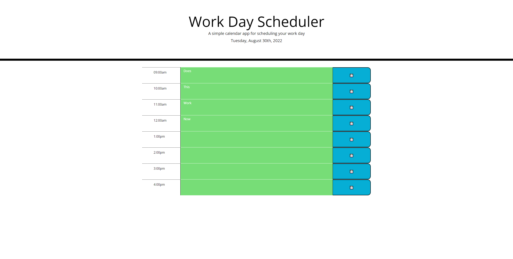
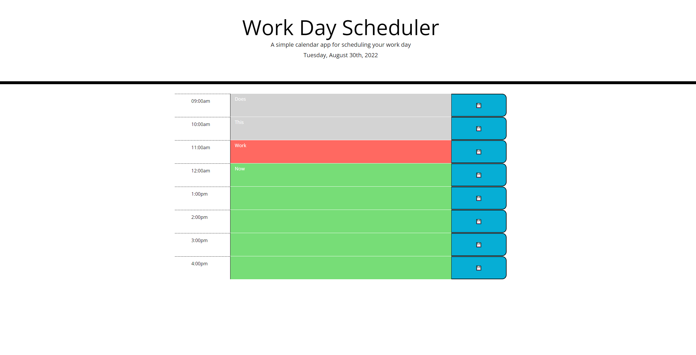

# word-Day-Scheduler
Writing javaScript to create a planner for the day. The focus of this was to write code to have a decent work day planner. It should indicate if certain timeslots are
past, present or future. The planner should also be able to save data inputted into it in the local storage. I made this using moment.js and jquery.

[Link to Website](https://wolfgang978.github.io/work-Day-Scheduler/ "Work Day Scheduler")
